# Ejercicio 1 — Mundo de Wumpus

## Objetivo

Crear una nueva configuración modificando la posición del Wumpus y de los pits, respetando las reglas del entorno, y analizar el efecto sobre los distintos agentes.

---
## Requisitos del nuevo mapa

1. Mantén la cuadrícula de **4x4** y el agente iniciando en `[1, 1]` mirando al
   este.
2. Cambia la posición del **Wumpus** a una casilla distinta de la del mapa
   clásico.
3. Cambia la posición de **los pits** (al menos **2** pits) a casillas distintas
   de las del mapa clásico.
4. Coloca el **oro** en una casilla alcanzable.
5. El mapa debe ser **válido** según las reglas del entorno (ver más abajo). Si
   rompes una regla, el programa lanzará un error al cargar el YAML.

### Reglas de validez (obligatorias)

- Todas las posiciones deben estar **dentro** de la cuadrícula (`1..4`).
- El agente **no** puede iniciar sobre un pit ni sobre el Wumpus.
- El **oro** no puede estar sobre un pit ni sobre el Wumpus.
- El **Wumpus** no puede estar sobre un pit.
- Además (para que la partida tenga sentido): deja al menos **un camino seguro**
  desde `[1, 1]` hasta el oro y de regreso a `[1, 1]`; no rodees la salida ni el
  oro por completo con pozos.

## Reto opcional

- Diseña una segunda variante (`config/mi_cueva_dificil_4x4.yaml`) en la que el
  **Wumpus bloquee el único camino seguro** hacia el oro. Observa que el agente
  basado en modelo se queda girando, mientras que el agente basado en metas
  (`04_goal_based_agent.py`) **dispara** para destrabar el paso.

## 1. Diseño de la cueva

### Mapa facil

**Archivo de configuración:**

```yaml
# VERSION FACIL
# mi_cueva_4x4.yaml
grid:
  width: 4
  height: 4

agent:
  start: [1, 1]
  direction: east
  arrows: 1

wumpus: [3, 3]

pits:
  - [1, 3]
  - [3, 2]
  - [4, 1]

gold: [4, 4]

scoring:
  gold: 1000
  death: -1000
  step: -1
  shoot: -10

max_steps: 200
```


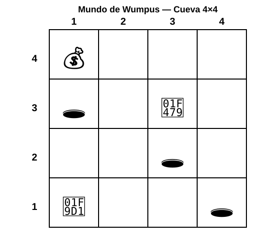


---

### Mapa dificil

**Archivo de configuración:**

```yaml
# VERSION DIFICIL
# mi_cueva_dificil_4x4.yaml
grid:
  width: 4
  height: 4

agent:
  start: [1, 1]
  direction: east
  arrows: 1

wumpus: [3, 3]

pits:
  - [1, 3]
  - [3, 2]
  - [4, 1]

gold: [4, 4]

scoring:
  gold: 1000
  death: -1000
  step: -1
  shoot: -10

max_steps: 200
```


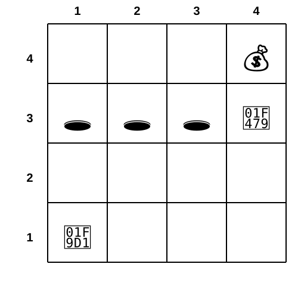


## 2. Pruebas de los agentes

Se realizo la ejecución de los 5 agentes proporcionados mediante Power Shell. Se realizo las mediciones de la version original, una primera version sencilla y posteriormente se configuro el .yml en un versión "facil" y posteriormente en una versión "dificil" donde el wumpus bloquea el unico camino seguro. Las versiones "facil" y "dificil" son los que se anexan con detalle en el reporte como entregables de la tarea.

### Version original
| Agente | Oro | Steps | Puntaje |
|---|:---:|:---:|---:|
| Simple reflex | N| 200| -200|
| Model based | Y| 19 | 981|
| Goal based | Y| 19 | 981| 
| Utility based |Y |24  |966 |
| Learning | Y|12 | 982| 

### Primer intento
| Agente | Oro | Steps | Puntaje |
|---|:---:|:---:|---:|
| Simple reflex | N| 200| -200|
| Model based | Y| 25 | 975|
| Goal based | Y| 25 | 975| 
| Utility based |Y |23  |977 |
| Learning | Y|14 | 986| 

### Version facil
| Agente | Oro | Steps | Puntaje | Observaciones |
|---|:---:|:---:|---:|---|
| Simple reflex | N| 200| -200|Se quedo dando vueltas entre los dos pits de la columa 3 y 4|
| Model based | N| 200 | -200|Se quedo dando vueltas entre los dos pits de la columa 1 y 3| 
| Goal based | N| 200 | -200|Se quedo dando vueltas entre los dos pits de la columa 1 y 3| 
| Utility based |N |13 |-1013 | Cayó en un pit|
| Learning | Y|18 | 982| |

### Version dificil (Reto)

| Agente | Oro | Steps | Puntaje | Observaciones |
|---|:---:|:---:|---:|---|
| Simple reflex | N| 200| -200||
| Model based | N| 200 | -200|| 
| Goal based | N| 200 | -210|Se quedo dando vueltas en el lugar del wumpus| 
| Utility based |Y |34 |956  |Unico en completar|
| Learning | N|1 | 1|  Se salio del juego sin el oro|
---

## 4. Análisis

Después de la ejecución de todos los agentes en multiples escenarios se observa los siguientes:
  - Simple reflex:  es el unico agente que no logro completar la misión en ningun escenario. Como prueba por aparte lo corri multiples veces y solo en un caso fortuito logro completar la misión pero no fue posible replicar el exito. De acuerdo a lo explicado en clase, se debe a que es de implementacion sencilla por lo que solo responde a las interacciones de su ambiente sin memorizar sus pasos previos.
  - Model based: en la versión original y en un primer intento si lograron completar la misión pero cuando se configuraron las versiones facil y dificil para entrega de la tarea no lograron completar la misión. Como parte de las preguntas para analisis se configuraron escenarios donde se acerca y aleja los pits de la casilla inicial y se observo que al estar lejos, el agente se le facilito encontrar el oro, al acercarse le tomaba mas pasos llegar y al estar muy cerca practicamente no pudo encontrar el camino
  - Goal based: este agente tuvo un comportamiento similar al model based, incluso sus puntajes fueron identicos
  - Utility based: Tanto en la versión original como en el primer intento tuvo un desempeño mejor que los anteriores. En la versión facil, no logro salir sino que cayo en un pit. En la versión dificil si lo logró
  - Learning: Este es es el que tuvo un mejor desemepeño en general. Superior que los demas en puntaje, menores pasos a excepción de la versión dificil donde se salió del juego sin el oro. Revisando los movimientos de la terminal intuimos que pudiera ser algun detalle que sucede durante el entrenamiento para que considere valido el salir del juego en los primeros pasos sin el oro


---

## 5. Evidencias

### Primer intento
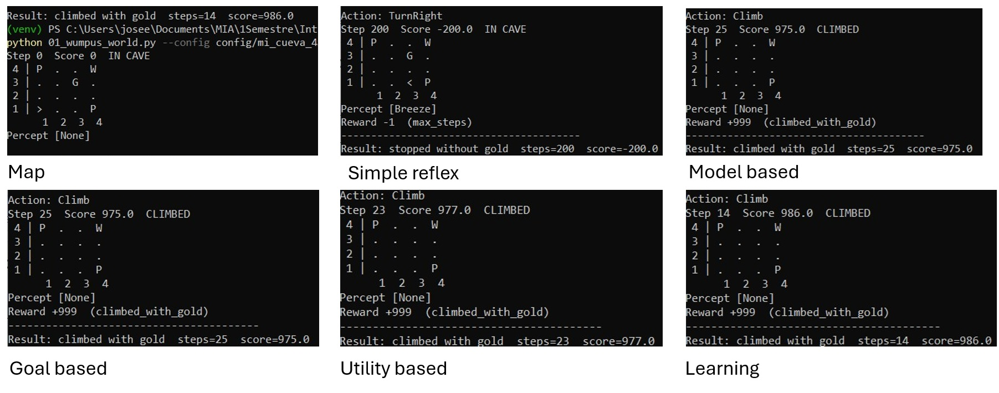

### Cambios del pit en el Model based
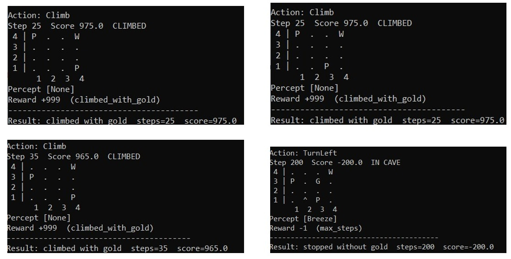

### Facil
**Mapa**

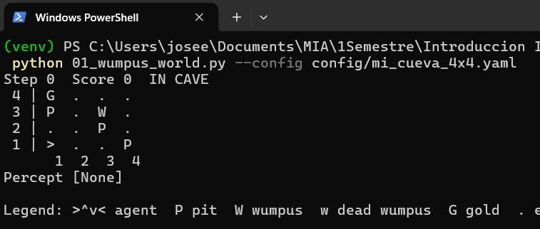

**Simple reflex**

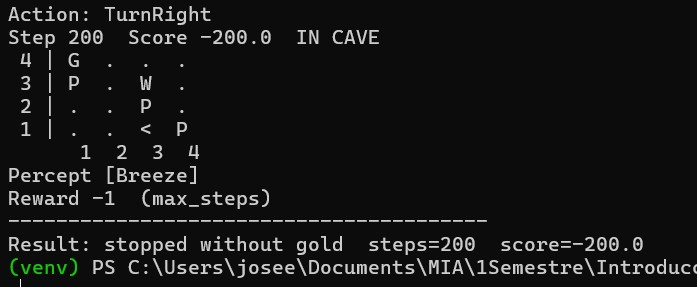

**Model based**

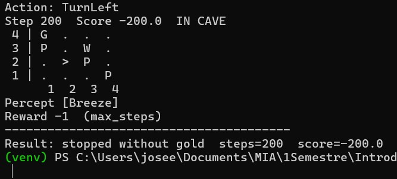

**Goal based**

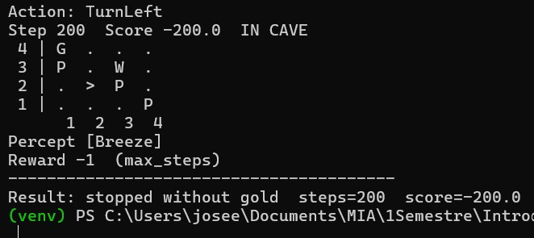

**Utility based**

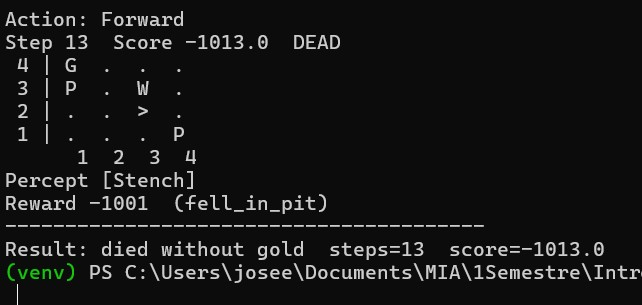

**Learning**

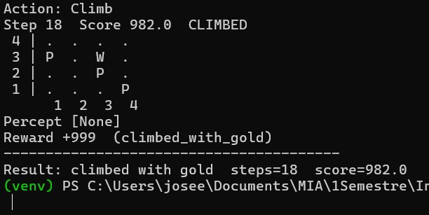

---

### Dificil

**Mapa**

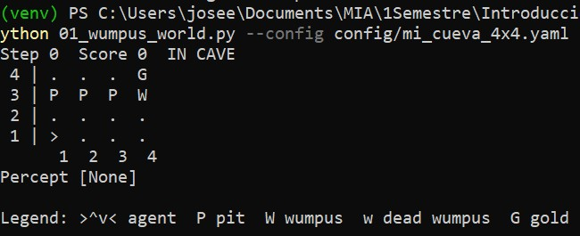

**Simple reflex**

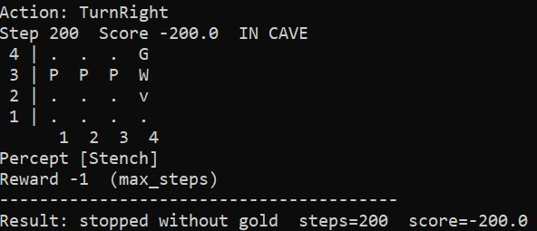

**Model based**

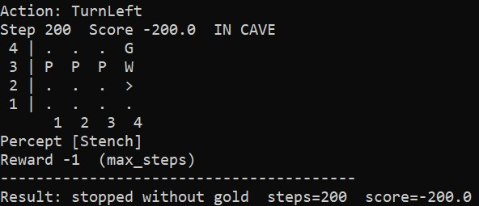

**Goal based**

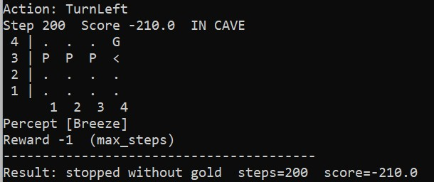

**Utility based**

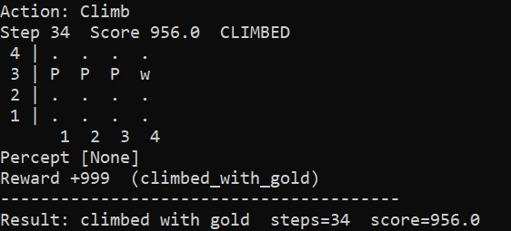

**Learning**

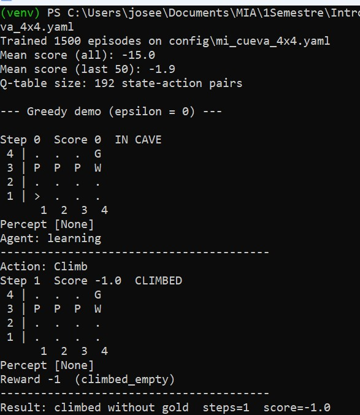


## 6. Conclusión

Con este ejercicio se tuvo un acercamiento al funcionamiento de los agentes vistos en clases. 
El simple agent es mas sencillo de implementar pero muy limitado en sus decisiones. Conforme se aumenta la complejidad del entorno pueden guardar sus estados previos e incluso aprender de su entorno. Sin embargo notamos que aun incluso con aprendizaje este puede fallar si en su entrenamiento aprende algo erroneo.
---

