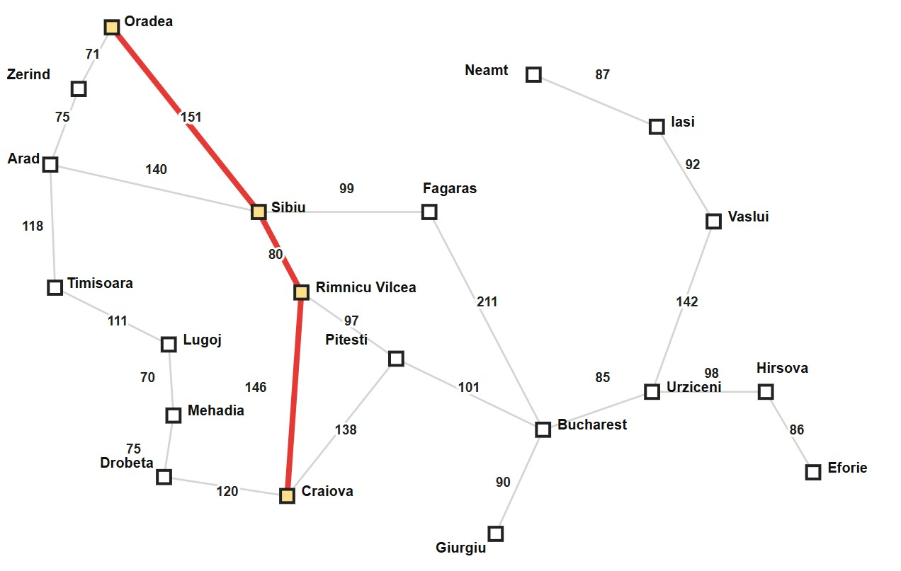
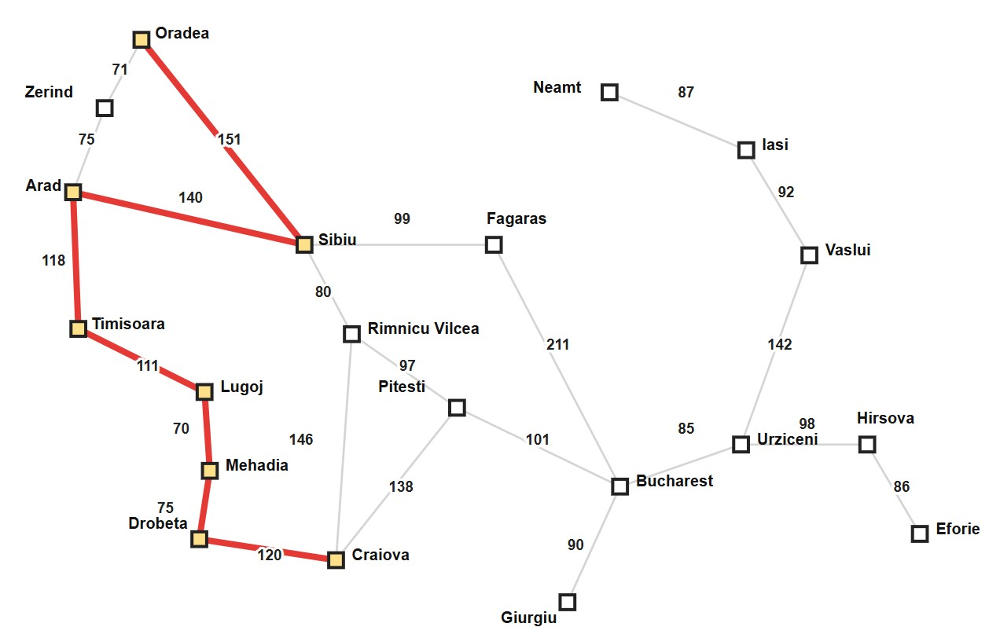
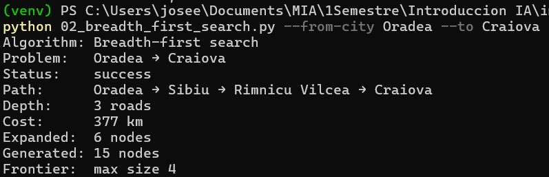
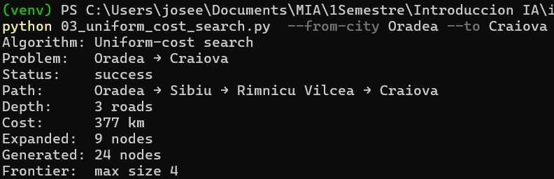
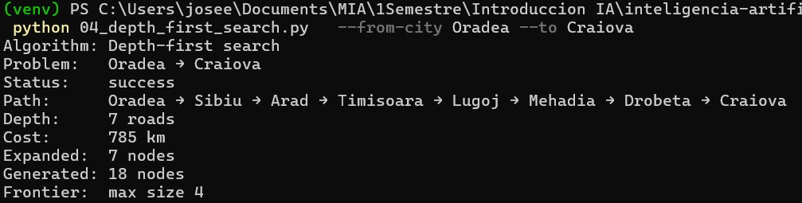
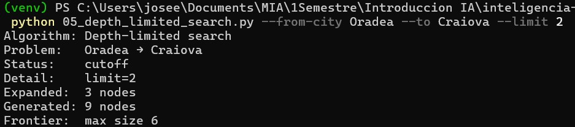
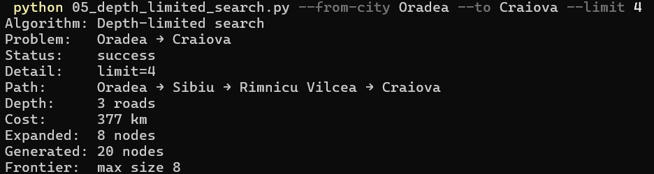
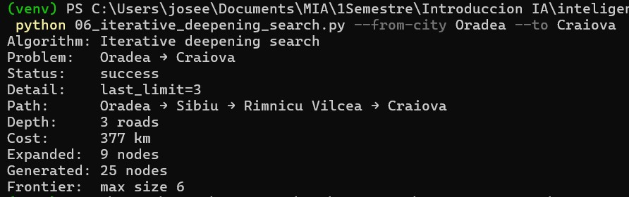

# Ejercicio 1 — Comparar BFS, UCS, DFS, DLS e IDS en el mapa de Rumania

## Contexto

En el proyecto `Búsqueda no informada/project` (AIMA cap. 3, Figura 3.2) se
resuelve el problema de **encontrar una ruta** entre dos ciudades del mapa
carretero de Rumania. Cinco algoritmos de búsqueda **no informada** comparten
el mismo grafo y el mismo `RouteFindingProblem`:

| Programa | Algoritmo | Qué optimiza (o no) |
|---|---|---|
| `02_breadth_first_search.py` | BFS | Menor número de **carreteras** (hops) |
| `03_uniform_cost_search.py` | UCS | Menor costo en **km** |
| `04_depth_first_search.py` | DFS | Ninguna garantía de optimalidad |
| `05_depth_limited_search.py` | DLS | DFS con límite de profundidad |
| `06_iterative_deepening_search.py` | IDS | Misma optimalidad de hops que BFS |

El caso por defecto es **Arad → Bucharest**. En este ejercicio **no vas a
programar** los algoritmos: vas a **elegir otra pareja origen–destino**,
ejecutar los cinco métodos y **explicar** por qué coinciden o discrepan.

Los vecinos se expanden en **orden alfabético**, así que los resultados son
deterministas si usas la misma pareja de ciudades.

## Objetivo

Elegir una ruta distinta de Arad → Bucharest, correr BFS, UCS, DFS, DLS e IDS,
y analizar diferencias de camino, costo, profundidad y nodos expandidos.

## 1. Ruta seleccionada

* **Origen:** Oradea
* **Destino:** Craiova

## 2. Ejecución de los algoritmos

| Algoritmo | Status | Path | Depth (roads) | Cost(km) | Expanded | Generated |
| :--- | :--- | :--- | :---: | :---: | :---: | :---: |
| BFS | Success | Oradea-Sibiu-Rimnicu Vilcea-Craiova | 3 | 377 | 6 | 15 |
| UCS | Success | Oradea-Sibiu-Rimnicu Vilcea-Craiova | 3 | 377 | 9 | 24 |
| DFS | Success | Oradea-Sibiu-Arad-Timisoara-Lugoj-Mehadia-Drobeta-Craiova | 7 | 785 | 7 | 18 |
| DLS1  | Cutoff | | 3 | | 3 | 9 |
| DLS2  | Success | Oradea-Sibiu-Rimnicu Vilcea-Craiova | 3 | 377 | 8 | 20 |
| IDS | Success | Oradea-Sibiu-Rimnicu Vilcea-Craiova | 3 | 377 | 9 | 25 |

1. Limite bajo
2. Límite suficiente

## 3. Mapas
**Todos los algoritmos excepto DFS**

**DFS**

## 4. Análisis

<!-- 
En tu reporte queda claro:
si BFS y UCS devolvieron el mismo camino o no, y por qué;
si IDS coincide con BFS en profundidad (número de carreteras);
qué pasó con DLS en el límite bajo (cutoff) frente al límite suficiente.

Un breve reporte (media página) que responda:
¿BFS encontró el camino con menos carreteras? ¿UCS el de menos km?
¿Por qué DFS puede devolver un camino más largo aunque el grafo sea el mismo?
¿Con qué --limit DLS pasó de cutoff a solución, y cómo se relaciona eso con la profundidad del camino de BFS/IDS?
-->

Al correr todos los algoritmos note que la mayoria encontro el camino. El DFS encontro una ruta pero no la optima; mientas que el DLS con limite=2 no encontro la ruta.
BFS y UCS encontraron el mismo camino, sin embargo el BFS tuvo que recurrir a mas nodos de busqueda para llegar a la ruta. Ambos coinciden ya que es la ruta mas corta en km y la que pasa por menos ciudades.
En cuando a IDS y BFS llegaron a la misma ruta y con el mismo numero de carreteras, pero recurrio a mas nodos para encontrar la ruta.
El DLS con limite = 2 no pudo encontrar la solucion ya que con el nivel de profundidad programado hay una ruta que requiera unicamente dos ciudades, como pasa por 3, al poner el limite en 4 si pudo encontrar la ruta. 
En cuanto al DFS que obtuvo una ruta mas larga, recordamos que el algoritmo explora de un nivel superior al inferior y al expandirse alfabeticamente pasa primero por el nodo que pasa por Arad y asi siguio hasta encontrar la ruta. 

## 5. Evidencias

### BFS

### UCS

### DFS

### DLS
**Limit 2**

**Limit 4**

### IDS

## 6. Conclusiones
En este ejercicio se comparo el performance de diversos algoritmos de busqueda y concluyo que es importante conocer las ventajas y desventajas de cada uno. El DFS en algunos casos puede no encontrar la solucion, asi como el DLS que si no tiene suficiente profundidad podria no alcanzar la solucion. De igual estos dos ultimos podrian encontrar la solucion pero podria darse el caso de no ser la solución optima. EL BFS y el UCS a pesar que pueden encontrar una solución optima tienen el inconveniente de consumir muchos recursos. El IDS encuentra un equilibrio conservando el menor uso de recursos y encontrar una solucion optima

## 7. Reto opcional
[Ver Reporte reto opcional](ejercicio_1_reto.md)

