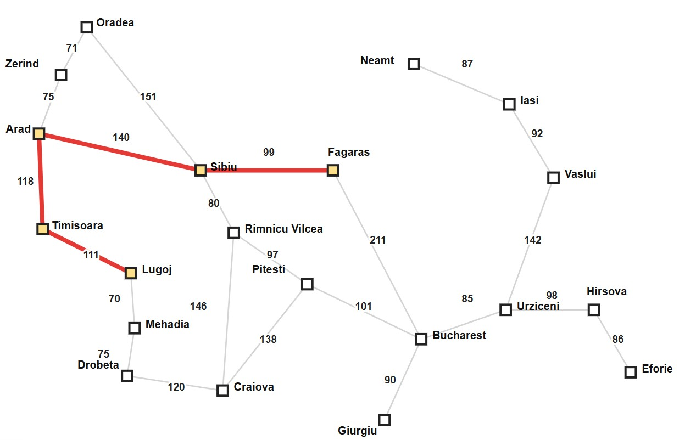
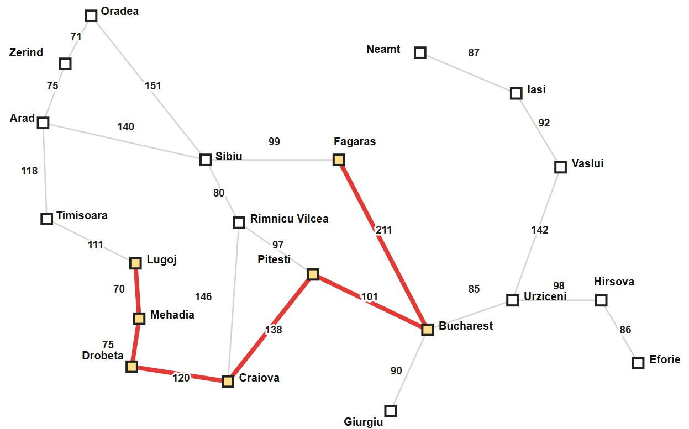
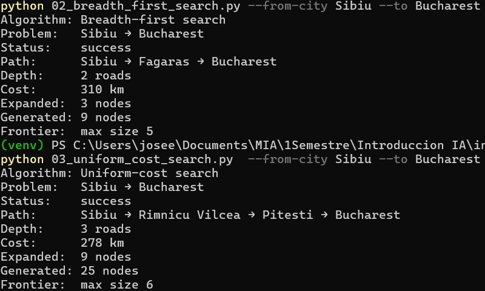
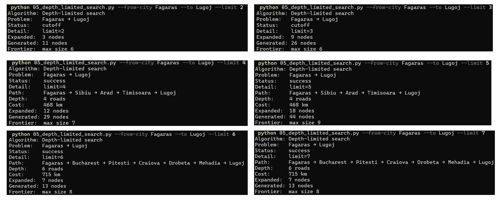

# Ejercicio 1 — Comparar BFS, UCS, DFS, DLS e IDS en el mapa de Rumania

## Reto opcional

- Elige una pareja en la que BFS y UCS **discrepen** claramente (camino con
  menos hops pero más km vs. camino más barato). Compara además el número de
  nodos expandidos: ¿cuál algoritmo “trabajó” más en tu instancia?
- Varía solo el destino (mismo origen) y observa cómo cambia el `--limit`
  mínimo de DLS para encontrar solución.

## 1. Ruta seleccionada

### Comparacion BFS vs UCS
* **Origen:** Sibiu
* **Destino:** Bucharest

### Comparacion DLS limit
* **Origen:** Fagaras
* **Destino:** Lugoj

## 2. Ejecución de los algoritmos

### Comparacion BFS vs UCS
| Algoritmo | Status | Path | Depth (roads) | Cost(km) | Expanded | Generated |
| :--- | :--- | :--- | :---: | :---: | :---: | :---: |
| BFS | Success | Sibiu-Fagaras-Bucharest| 2 | 310 | 3 | 9 |
| UCS | Success | Sibiu-Rimnicu Vilcea-Pitesti-Bucharest | 3 | 278 | 9 | 25 |

### Comparacion DLS limit

| Limit | Status | Path | Depth (roads) | Cost(km) | Expanded | Generated |
| :--- | :--- | :--- | :---: | :---: | :---: | :---: |
| 2 | Cutoff ||  |  | 3 | 11 |
| 3 | Cutoff |  |  | | 9 | 26 |
| 4 | Success | Fagaras - Sibiu - Arad - Timisoara - Lugoj| 4 | 468 | 12 | 29 |
| 5 | Success | Fagaras - Sibiu - Arad - Timisoara - Lugoj| 4 | 468 | 18 | 44 |
| 6 | Success |  Fagaras - Bucharest - Pitesti - Craiova - Drobeta - Mehadia - Lugoj| 6 | 715 | 7 | 13 |
| 7 | Success |  Fagaras - Bucharest - Pitesti - Craiova - Drobeta - Mehadia - Lugoj| 6 | 715 | 7 | 13 |

---

## 3. Mapas

### Comparacion BFS vs UCS
**BFS**

**UCS**

### Comparacion DLS limit

**DLS: Limit 4,5** 

**DLS: Limit 6,7**

## 4. Análisis
<!-- 
- Elige una pareja en la que BFS y UCS **discrepen** claramente (camino con
  menos hops pero más km vs. camino más barato). Compara además el número de
  nodos expandidos: ¿cuál algoritmo “trabajó” más en tu instancia?
- Varía solo el destino (mismo origen) y observa cómo cambia el `--limit`
  mínimo de DLS para encontrar solución.
 -->
### Comparacion BFS vs UCS
Como se observa en los resultados y el mapa el BFS recorrio la ruta con menos ciudades mientras que la UCS encontró la ruta menos costosa. El UCS termino generando mas nodos esto es porque va buscando el camino optimo.

### Comparacion DLS limit
En cuanto al DLS se observa que va buscando a mas profundidad segun el limite establecido. Se comprueba que si existe un limite muy pequeño es posible que no exista solucion y de igual forma un limite alto podria encontrar una ruta aunque no sea la optima. Un limite intermedio lograr encontrar un camino optimo.

## 5. Evidencias
### Comparacion BFS vs UCS

### Comparacion DLS limit

## 6. Conclusiones

De este reto sirvio para visualizar mejor como encuentran la solucion el BFS y el UCS, asi como comprobar la utilidad del limit para el DLS