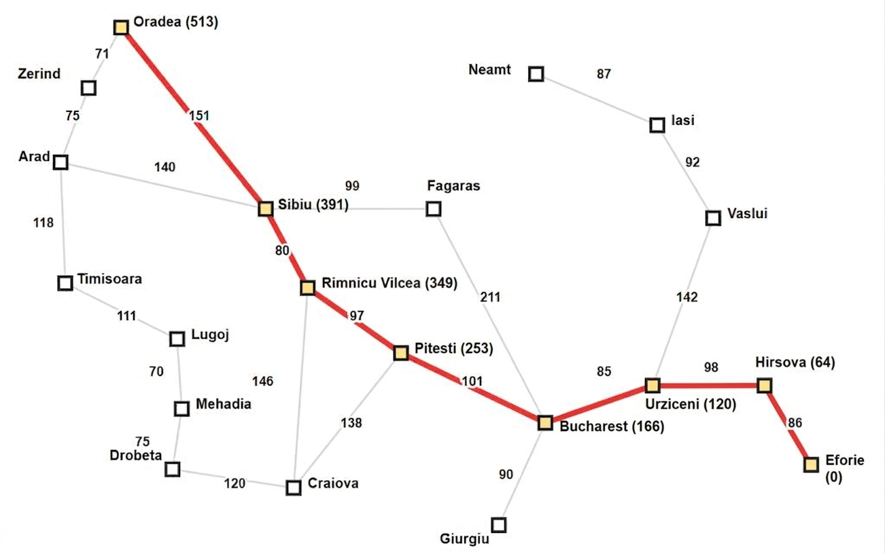
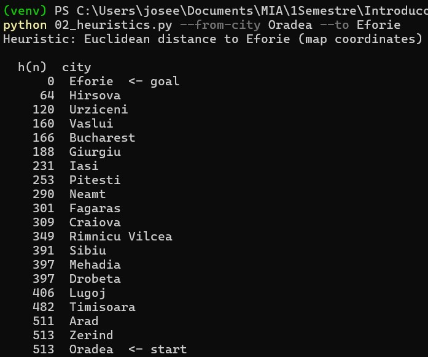
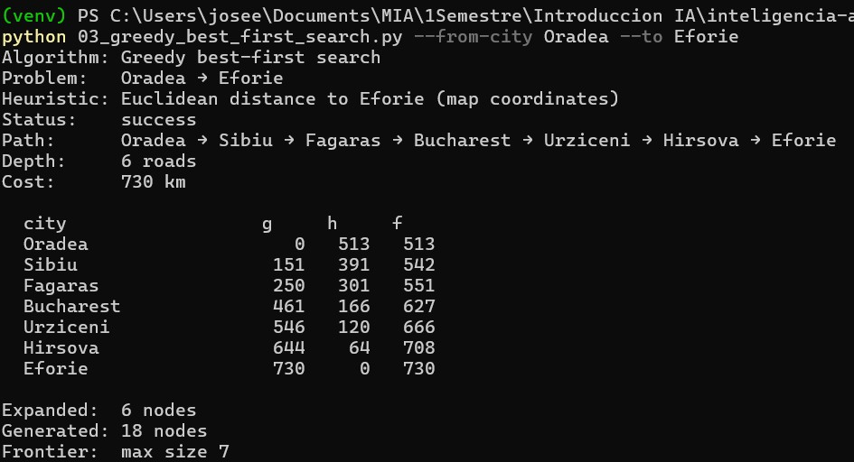
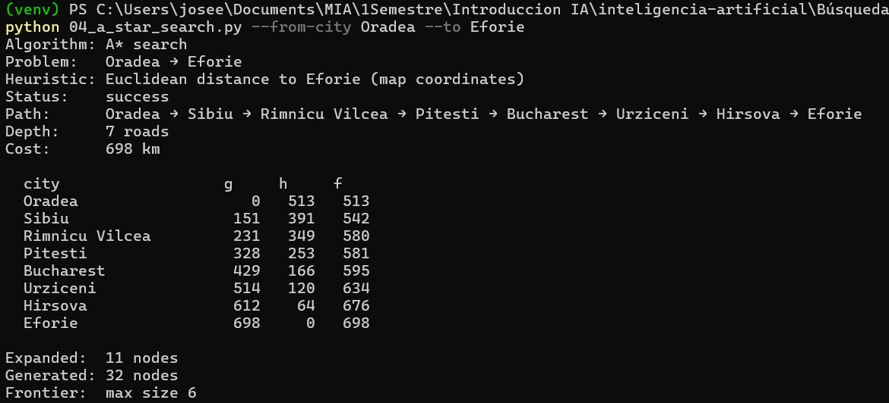

# Ejercicio 1 — Comparar Greedy y A* en el mapa de Rumania

## Contexto

En el proyecto `Búsqueda informada/project` (AIMA cap. 3–4, Figuras 3.2 y 3.22)
se resuelve el problema de **encontrar una ruta** entre dos ciudades del mapa
carretero de Rumania. Dos algoritmos de búsqueda **informada** comparten el
mismo grafo, el mismo `RouteFindingProblem` y la misma heurística `h(n)`:

| Programa | Algoritmo | Qué optimiza (o no) |
|---|---|---|
| `03_greedy_best_first_search.py` | Greedy best-first | Expande el menor `h(n)` (sin garantía de optimalidad) |
| `04_a_star_search.py` | A* | Expande el menor `f(n) = g(n) + h(n)` (óptimo si `h` es admisible) |

El caso por defecto es **Arad → Bucharest**. En este ejercicio **no vas a
programar** los algoritmos: vas a **elegir otra pareja origen–destino**,
ejecutar ambos métodos y **explicar** por qué coinciden o discrepan.

Los vecinos se expanden en **orden alfabético**, así que los resultados son
deterministas si usas la misma pareja de ciudades.

A* (y Greedy) necesitan `h(n)` = estimado desde **cualquier ciudad** hasta el
destino que elegiste. Eso ya está resuelto: no implementas `h`. Al pasar
`--to DESTINO`, `heuristic_for` construye `h(ciudad)` para las 20 ciudades:

- Si el destino es **Bucharest**, usa la **distancia en línea recta** de la
  tabla AIMA (admisible y consistente).
- Si el destino es **cualquier otra ciudad**, usa la **distancia euclidiana**
  entre las coordenadas del mapa (también admisible: nunca sobreestima el
  costo por carretera).

Puedes verificarlo con `python 02_heuristics.py --to DESTINO`: imprime `h`
de cada ciudad hacia ese destino.

## Objetivo

Elegir una ruta distinta de Arad → Bucharest, inspeccionar `h(n)`, correr
Greedy y A*, y analizar diferencias de camino, costo, profundidad y nodos
expandidos a la luz de `g`, `h` y `f`.

## 1. Ruta seleccionada

* **Origen:** Oradea
* **Destino:** Eforie

## 2. Ejecución de los algoritmos

### Greedy
| city | g | h | f |
| :--- | :---: | :---: | :---: |
| Oradea | 0 | 513 | 513 |
| Sibiu | 151 | 391 | 542 |
| Fagaras | 250 | 301 | 551 |
| Bucharest | 461 | 166 | 627 |
| Urziceni | 546 | 120 | 666 |
| Hirsova | 644 | 64 | 708 |
| Efore | 730 | 0 | 730 |

### A*

| city | g | h | f |
| :--- | :---: | :---: | :---: |
| Oradea | 0 | 513 | 513 |
| Sibiu | 151 | 391 | 542 |
| Rimnicu Vilcea | 231 | 349 | 580 |
| Pitesti | 328 | 253 | 581 |
| Bucharest | 429 | 166 | 595 |
| Urziceni | 514 | 120 | 634 |
| Hirsova | 612 | 64 | 676 |
| Efore | 698 | 0 | 698 |

### Comparacion
| Algoritmo | Status | Path | Depth | Cost | Expanded | Generated |
| :--- | :--- | :--- | :---: | :---: | :---: | :---: |
| Greedy | Success | Oradea-Sibiu-Fagaras-Bucharest-Urziceni-Hirsova-Eforie | 6 | 730 | 6 | 18 |
| A* | Success | Oradea-Sibiu-Rimnicu Vilcea-Pitesti-Bucharest-Urziceni-Hirsov | 7 | 698 | 11 | 32 |

---

## 3. Mapas
### Greedy

### A*

## 4. Análisis

<!-- 
- En tu reporte queda claro:
  - si Greedy y A* devolvieron el **mismo** camino o no, y por qué;
  - qué heurística se usó (tabla AIMA vs. euclidiana);
  - en al menos un punto de decisión, cómo `h(n)` (Greedy) frente a
    `f(n) = g(n) + h(n)` (A*) explica la ciudad que cada algoritmo expandió.
Un breve reporte (media página) que responda:
   - ¿A* encontró el camino de **menos km**? ¿Greedy coincidió o se desvió?
   - ¿Por qué Greedy puede devolver un camino más caro aunque `h` sea
     admisible?
   - En el camino de A*, ¿`f` tiende a **no disminuir** a lo largo de la ruta?
     Relaciónalo con que `h` sea consistente (en particular si el destino es
     Bucharest y se usa la tabla AIMA).
-->

Despues de ejecutar el algoritmo notamos los algoritmos no conincidieron en rutas. La heuristica uso la euclidiana. A*  encontró el camino con menos km. Greedy tomo una desviación a Fagaras y es porque considera la h mas corta. Cuando llega a Sibiu nota que con Fagaras le faltaran 301 y con Rimnicu Vilcea 349, por lo que toma el camino "mas corto" aparentemente.
en Sibiu

  - Greedy: 

**Fagaras:**
$$h(n)=301$$
**Rimnicu Vilcea**: `
$$h(n)=349$$

El algoritmo Greedy elige Fagaras por tener heuristica menor

  - A*: 

**Fagaras:** 
$$f(n) = g(n) + h(n) = 250+301=551$$
**Rimnicu Vilcea:** 
$$f(n) = g(n) + h(n) = 231+349=580$$

El algoritmo A* elige en primera instancia Fagaras pero en el siguiente nodo
**Bucharest:** 
$$f(n) = g(n) + h(n) = 461+166=627$$

Por lo que regresa y toma el camino de Rimnicu Vilcea

## 5. Evidencias

### Heuristica

### Greedy 

### A* 

## 6. Conclusiones

De acuerdo a los resultados concluimos que la heuristica es de gran ayuda para minimizar la cantidad de nodos utilizados. El algoritmo Greedy encuentra la ruta aunque no siempre obtiene la ruta optima. Al contrario de A* que si logra encontrar la ruta optima, aunque usa un ligero mayor numero de nodos.

## 7. Reto opcional
[Ver Reporte reto opcional](ejercicio_1_reto.md)