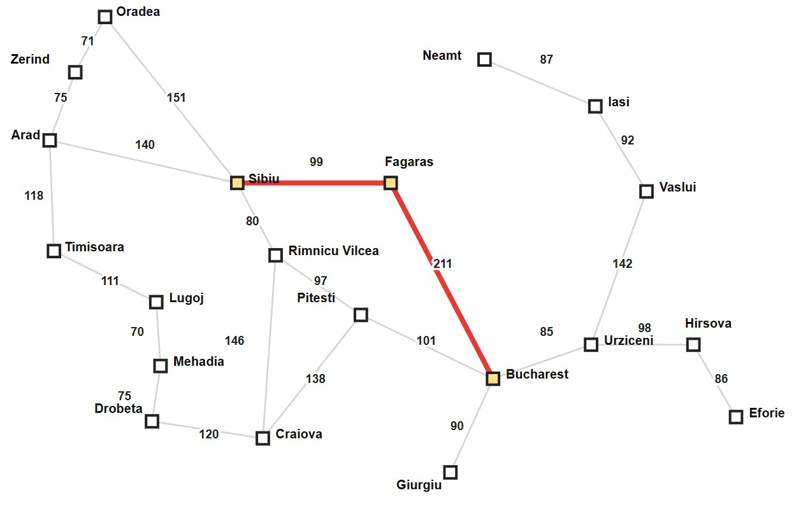
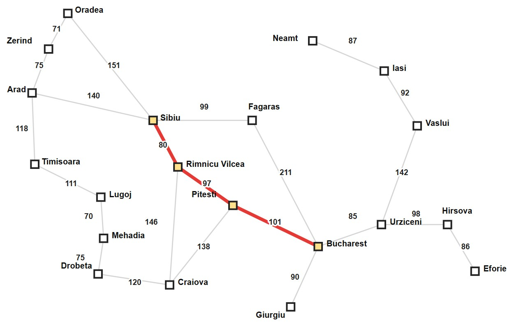
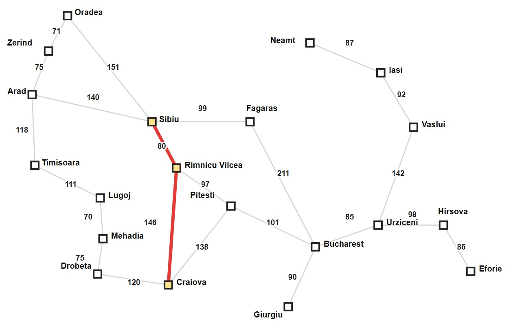
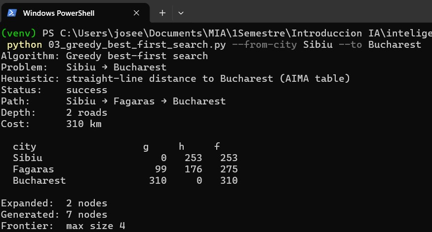
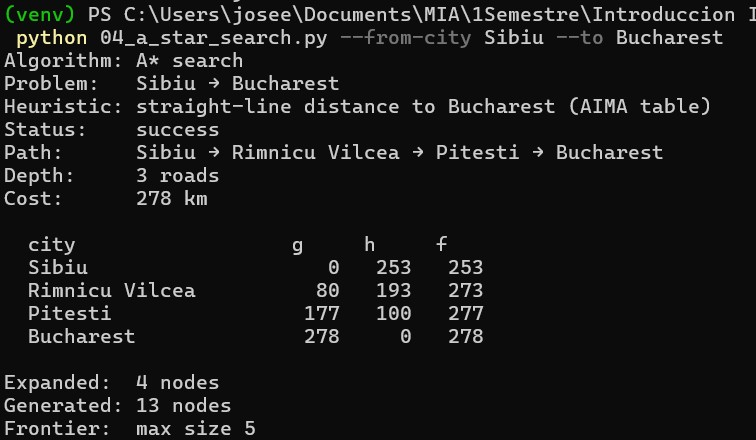
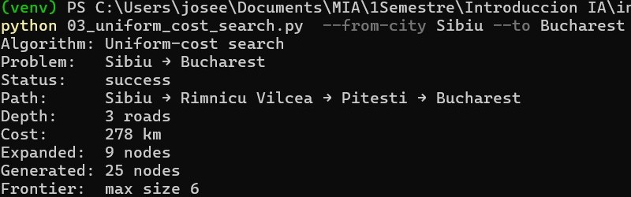
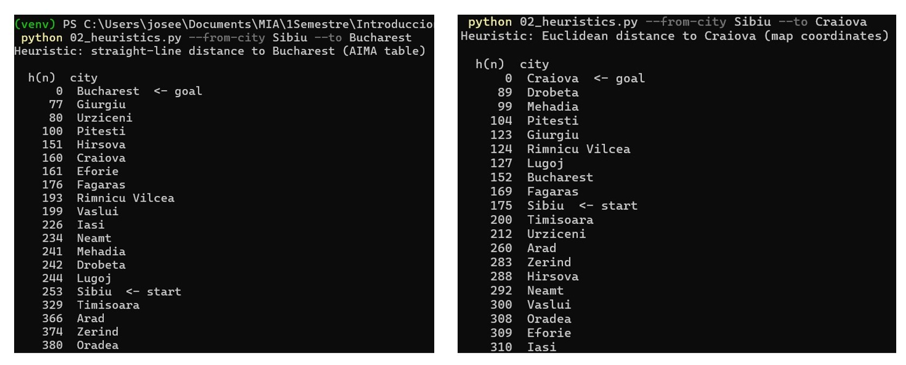

# Ejercicio 1 — Comparar Greedy y A* en el mapa de Rumania
## Reto opcional

- Elige una pareja en la que Greedy y A* **discrepen** claramente (Greedy
  “se acerca” en línea recta pero paga más km). Compara además el número de
  nodos expandidos: ¿cuál algoritmo “trabajó” más en tu instancia?
- Corre la **misma** pareja con UCS en
  `Búsqueda no informada/project` (`03_uniform_cost_search.py`). Si `h` es
  admisible, el costo de A* debería coincidir con el de UCS; Greedy no
  tiene por qué.
- Cambia solo el destino (mismo origen): una vez a Bucharest y otra a una
  ciudad distinta. Observa cómo cambia la etiqueta de la heurística y si
  Greedy sigue (o deja de) coincidir con A*.

## 1. Ruta seleccionada

### 1er par de Ciudades para comparar heuristicas y donde una se acerca en linea recta pero paga mas km
* **Origen:** Sibiu
* **Destino:** Bucharest

### 2do par de Ciudades para comparar heuristicas

* **Origen:** Sibiu
* **Destino:** Craiova

## 2. Ejecución de los algoritmos

### Greedy
| City | g | h | f |
| :--- | :---: | :---: | :---: |
| Sibiu | 0 | 253 | 253 |
| Fagaras | 99 | 176 | 275 |
| Bucharest | 310 | 0 | 310 |

### A*

|City | g | h | f |
| :--- | :---: | :---: | :---: |
| Sibiu | 0 | 253 | 253 |
| Rimnicu Vilcea | 80 | 193 | 273 |
| Pitesti | 177 | 100 | 277 |
| Bucharest | 278 | 0 | 278 |

### Comparacion
| Algoritmo | Status | Path | Depth | Cost | Expanded | Generated |
| :--- | :--- | :--- | :---: | :---: | :---: | :---: |
| Greedy | Success | Sibiu-Fagaras-Bucharest| 2 | 310 | 2 | 7 |
| A* | Success | Sibiu-Rimnicu Vilcea-Pitesti-Bucharest | 3 | 278 | 4 | 13 |
| UCS | Success | Sibiu-Rimnicu Vilcea-Pitesti-Bucharest | 3 | 278 | 9 | 25 |

---

## 3. Mapas
### Greedy

### A*, UCS

### 2do par Comparacion heuristica

## 4. Análisis

<!-- 
- Elige una pareja en la que Greedy y A* **discrepen** claramente (Greedy
  “se acerca” en línea recta pero paga más km). Compara además el número de
  nodos expandidos: ¿cuál algoritmo “trabajó” más en tu instancia?
- Corre la **misma** pareja con UCS en
  `Búsqueda no informada/project` (`03_uniform_cost_search.py`). Si `h` es
  admisible, el costo de A* debería coincidir con el de UCS; Greedy no
  tiene por qué.
- Cambia solo el destino (mismo origen): una vez a Bucharest y otra a una
  ciudad distinta. Observa cómo cambia la etiqueta de la heurística y si
  Greedy sigue (o deja de) coincidir con A*.
-->

En nuestro 1er par de ciudades en la ruta Sibiu-Bucharest, el A* trabajo mas o recorrio mas nodos para encontrar la solución, sin embargo encontro la solución mas corta. Tambien lo comparamos con el metodo UCS y efectivamente coincidio con la ruta seleccionada con A*.
Se hizo una prueba mas cambiando el destino. Para este caso se uso Sibiu-Craiova y se observa como cambiaron las heuristicas. En este ultimo caso ambas rutas tanto Greedy y A* coincidieron en su ruta.  

## 5. Evidencias

### Greedy 

### A* 

### UCS

### Comparativo heuristicas

## 6. Conclusiones

Se concluye  que la heuristica se calcula en base a la ciudad destino y que el algoritmo A* encuentra la ruta optima