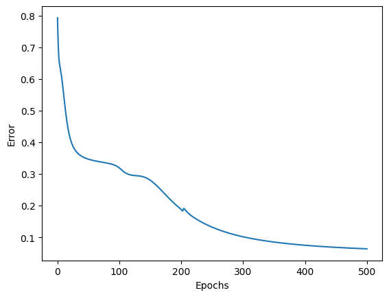
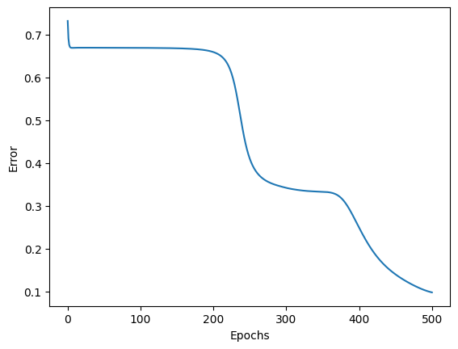
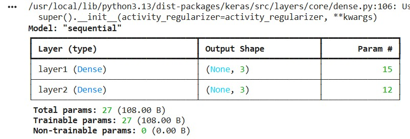
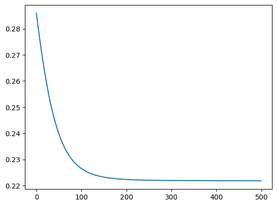
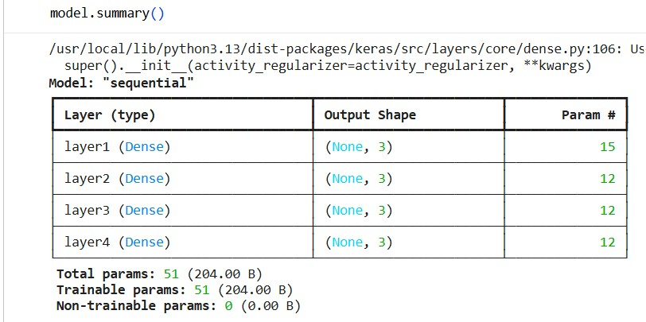
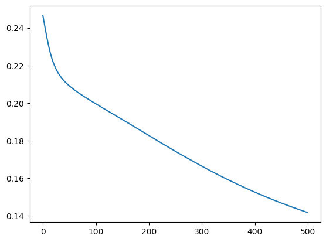
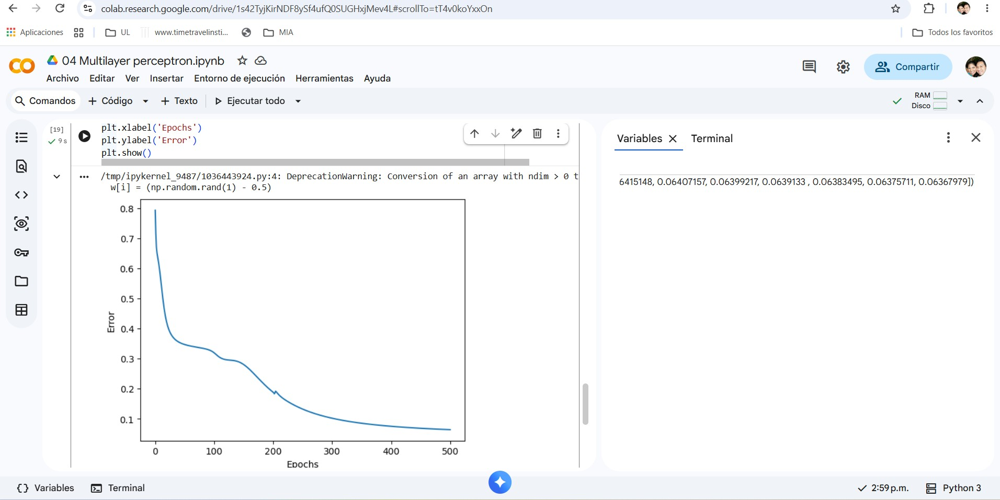
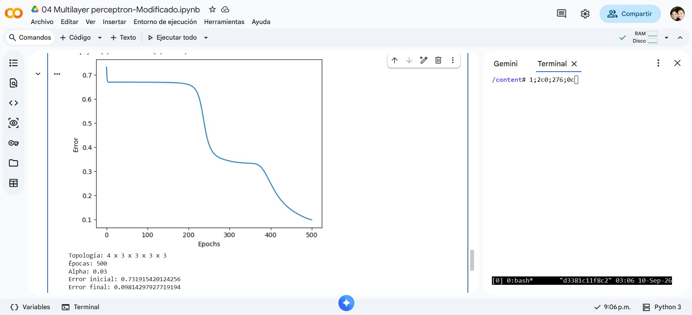
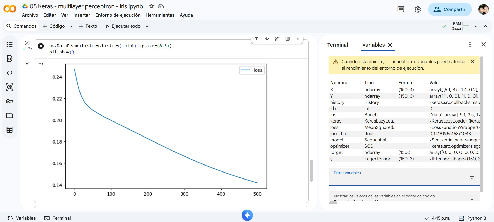
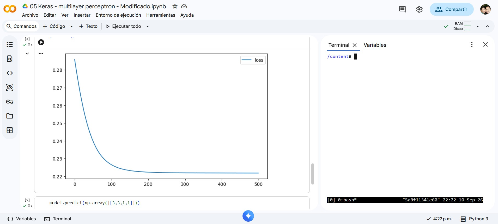

# Ejercicio 1 — Más capas en el perceptrón multicapa (Iris)

## Contexto

En `Perceptrón multicapa/Notebooks/` hay dos notebooks que resuelven el mismo
problema: clasificar las **3 especies** del conjunto **Iris** (4 atributos:
sépalo/pétalo en largo y ancho). Ambas redes son un MLP con activación
**sigmoide**, error **MSE**, **SGD** con \(\eta = 0.03\) y **500 épocas**.

| Notebook | Cómo está implementada | Topología inicial |
|---|---|---|
| `01 Multilayer perceptron.ipynb` | A mano (NumPy): forward, error y backprop | \(4 \times 3 \times 3\) |
| `02 Keras - multilayer perceptron - iris.ipynb` | Keras / TensorFlow (`Sequential`) | \(4 \times 3 \times 3\) |

En la notebook 01, \(4 \times 3 \times 3\) significa: **4** entradas, **una**
capa oculta de **3** neuronas y **3** neuronas de salida (una por clase). En
Keras es lo mismo: dos `Dense(3)` (la primera con `input_shape=(4,)`).

En este ejercicio **sí vas a modificar código**, pero no el de
`Perceptrón multicapa/project/`. Trabajas **en Colab**, sobre **copias** de las
dos notebooks.

## Objetivo

Correr ambas notebooks en **Google Colab** con la arquitectura original,
**agregar dos capas** a cada red, volver a entrenar y **comparar** qué cambia
(curva de error/pérdida, velocidad, calidad de la clasificación).

# 1. Notebook 01 — Implementación a mano (NumPy)

## 1.1 Red original

### Topología

\[
4 \times 3 \times 3
\]

### Curva de error

### Error final
0.06367979

---

## 1.2 Red profunda

### Topología

\[
4 \times 3 \times 3 \times 3 \times 3
\]

### Curva de error

### Error final
0.09814297927719194

# 2. Notebook 02 — Implementación con Keras

## 2.1 Red original

### Topología

\[
4 \times 3 \times 3
\]

### `model.summary()`

### Curva de pérdida

### Pérdida final

0.1418195515871048
---

---

## 2.2 Red profunda

### Topología

\[
4 \times 3 \times 3 \times 3 \times 3
\]

### `model.summary()`

### Curva de pérdida

### Pérdida final
0.22183367609977722

# 3. Comparacion
| Notebook | Error |
| :--- | :--- |
| Manual original | 0.06367979 |
| Manual modificado | 0.09814298 |
| Keras original | 0.14181955 |
| Keras modificado | 0.22183368 |

# 4. Analisis
<!-- 
El reporte compara implementación a mano vs. Keras y red original vs. red más profunda; no es un resumen de lo que “debería” pasar sin números.
Un breve reporte (media página a una página) que responda:
¿Bajar más el error al añadir dos capas, o se estancó / empeoró? ¿Igual en NumPy y en Keras?
¿Las curvas de la notebook 01 y de Keras se parecen con la misma topología? Si no, ¿qué diferencias de implementación podrían explicarlo (orden de los datos, inicialización, vectorización, etc.)?
Con sigmoides apiladas y MSE, ¿tiene sentido que una red más profunda no aprenda mejor en Iris? Relaciónalo con lo que viste en las gráficas.

-->

Despues de correr los 4 modelos notamos que:
- Los modelos manuales arrojaron el menor error
- Las redes con mas capas tuvieron un error mayor
Es decir que la obtuvo el menor error fue la manual con menos capas. 
Las curvas de Keras y el metodo manual son parecidas pero se observa que el de Keras tiene una curva que va cambiando sutilmente, es decir no cambia el error abruptamente.
Intuimos que esta diferencia esta relacionado a la asignacion inicial de pesos. De acuerdo a las graficas Keras asigna pesos mas pequeños que en el metodo manual, ademas que tiene descensos mas leves lo que provoca que no llegue a un error tan bajo como el manual por lo que pudiera ser la configuracion interna que ajusta los pesos en proporciones pequeñas.
Al parecer al ser un dataset no muy complejo, al agregar mas capas profundas solo añade complejidad innecesaria

# 5. Evidencias de ejecución en Colab

## NumPy — Original

## NumPy — Profunda

## Keras — Original

## Keras — Profunda

# 6. Conclusiones

En este ejercicio aprendimos sobre el perceptron multicapa y reconocemos que el agregar mas capas de redes neuronales no significa que de mejores resultados

# 7. Codigo Entregable 
- [Multilayer perceptron](04_Multilayer_perceptron-Modificado.ipynb)
- [Keras](05_Keras_multilayer_perceptron-Modificado.ipynb)