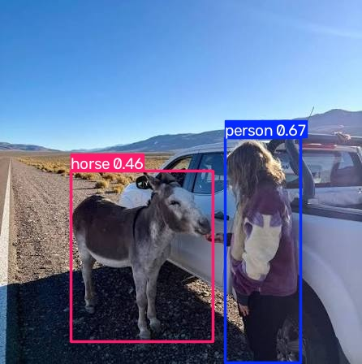
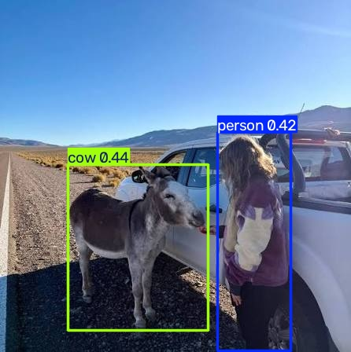
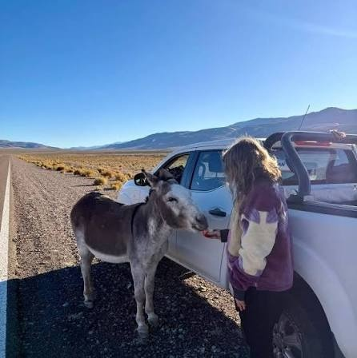
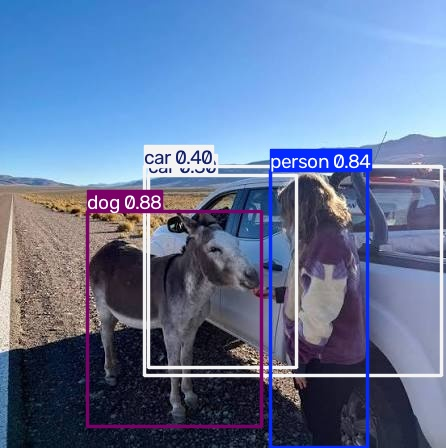
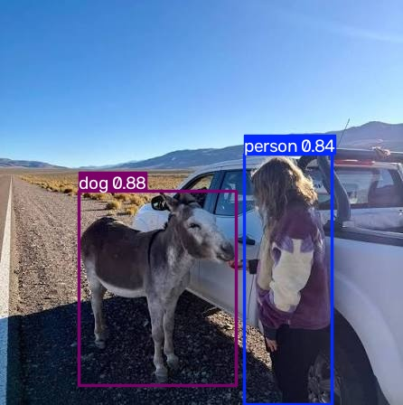
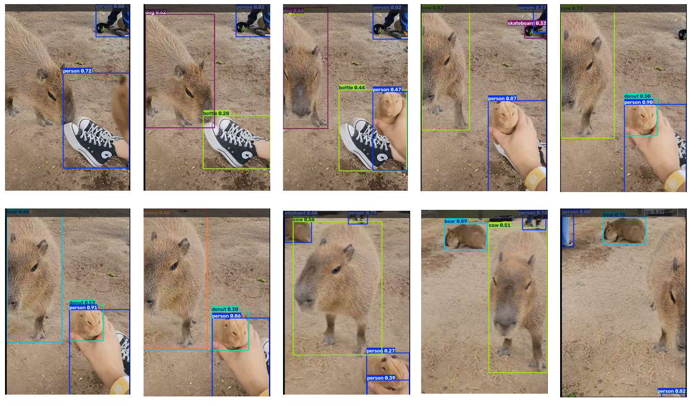
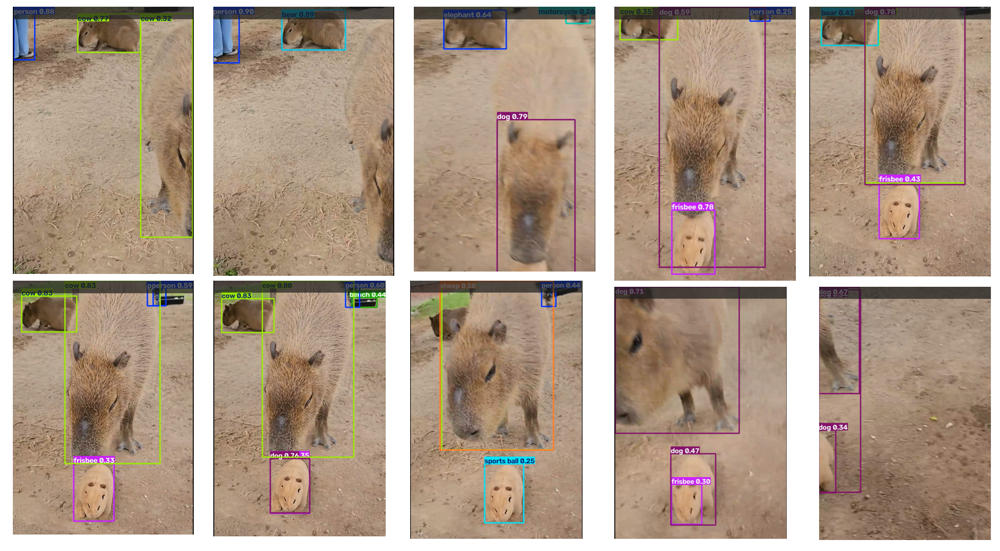
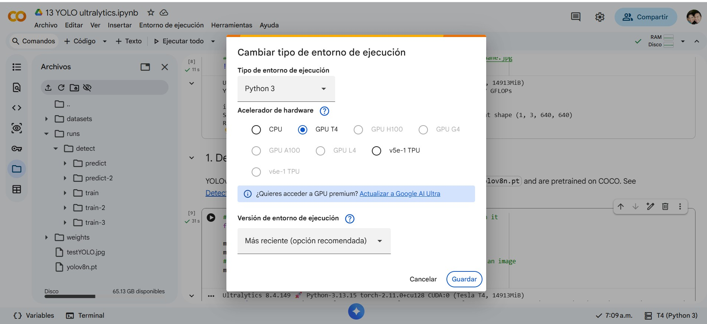

# Ejercicio 1 — Cambiar la imagen de predicción en YOLO

## Contexto

La notebook `Visión computacional/Notebooks/13 YOLO ultralytics.ipynb` es un
tutorial corto de **YOLOv8** (paquete Ultralytics) pensado para **Google
Colab**. Hace tres cosas:

1. Instala `ultralytics` y comprueba el entorno.
2. Corre inferencia por CLI sobre la foto de muestra `zidane.jpg`.
3. Carga `yolov8n.pt`, entrena **3 épocas** en `coco128` y predice
   `bus.jpg`.

YOLO detecta objetos de las clases **COCO** (persona, auto, bus, corbata,
etc.) y dibuja cajas. En este ejercicio **sí vas a modificar código**, pero
solo un cambio pequeño y visible: **la imagen sobre la que predice**.

No toques `Visión computacional/project/`. Trabajas en **Colab**, sobre una
**copia** de la notebook.

## Objetivo

Correr la notebook en Colab **tal como está**, sustituir las dos imágenes de
muestra por **una imagen tuya** (la misma en ambas predicciones) y comparar
qué objetos detecta YOLO en la foto original frente a la tuya.

## 1. Ejecución Original (`zidane.jpg` y `bus.jpg`)
* **Predicción CLI (`zidane.jpg`):**
  * **Clases detectadas:** personas y corbata
  * **Número aproximado de cajas:** 3
  * **Captura de salida:**  
    

* **Predicción Python (`bus.jpg` tras reentrenamiento de 3 épocas en `coco128`):**
  * **Clases detectadas:** personas, autobus y señal de alto
  * **Número aproximado de cajas:** 6
  * **Captura de salida:**  
    

---

## 2. Ejecución Modificada (Imagen Propia)
* **Archivo / Fuente utilizada:** `testYOLO.jpg`
* **Predicción CLI :**
  * **Clases detectadas:** Caballo y persona
  * **Número de cajas dibujadas:** 2
  * **Captura de salida:**  
    

* **Predicción Python:**
  * **Clases detectadas:** Vaca y persona
  * **Número de cajas dibujadas:** 2
  * **Captura de salida:**  
    

## 3. Reto Opcional 

### Umbral de Confianza Estricto (`conf=0.7`)
* **Observaciones:** Desaparecieron las 2 cajas
* **Captura de salida:**  
  

### Cambio de Modelo a `yolov8s.pt` 
* **Observaciones:** El cambio de modelo identifico 2 autos adicional y el burro lo detecto como perro
* **Captura de salida:**  
  

### Cambio de Modelo a `yolov8s.pt` (`conf=0.7`)
* **Observaciones:** Desaparecio la caja de auto y se mantuvo persona y perro
* **Captura de salida:**  
  

### Prueba con Video (`source='kapibara.mp4'`)
* **Observaciones:** El unico que identifico bien fue la persona ya que el kapibara lo identifico como varios animales excepto el correcto: oso, vaca, dona, pelota

**Se anexa el video mp4 en la carpeta**

<!--  -->

**Objetos detectados**
 
 
 

## 4. Evidencia 
 

## 5. Análisis 

<!-- Un breve reporte (media página) que responda:
¿Qué clases detectó YOLO en las fotos de Ultralytics y cuáles en la tuya?
¿Algún objeto evidente de tu foto no salió etiquetado? ¿Por qué podría pasar (clase que no está en COCO, objeto chico, recorte, umbral de confianza)?
¿La predicción de la celda CLI y la de model(...) coinciden sobre tu misma imagen? -->

En la imagen de Ultralytics encontro personas y objetos como corbata, autobus y señal de alto. En contraste en mi imagen encontro persona e identifico mal un burro. Con CLI lo clasifico como caballo (cerca) y en el otro lo confundio con vaca posiblemente por la iluminacio parece blanco y negro. Esto posiblemente al umbral de confianza
En cuanto al video el video generado fue de mayor tamaño que el original y pudo encontrar los animales pero no los clasifico correctamente. En cambio el pie humano si lo identifico correctamente

## 6. Conclusiones

El modelo de entrenamiento y el umbral de confianza cambian si detecta cierto objeto y si logra identificarlo

# 7. Entregable
[Ver Script YOLO](13_YOLO_ultralytics_modificado.ipynb)