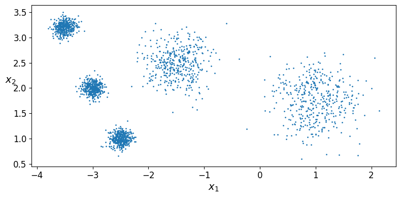
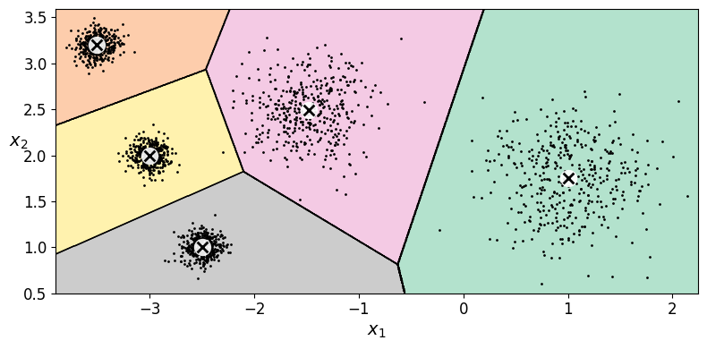
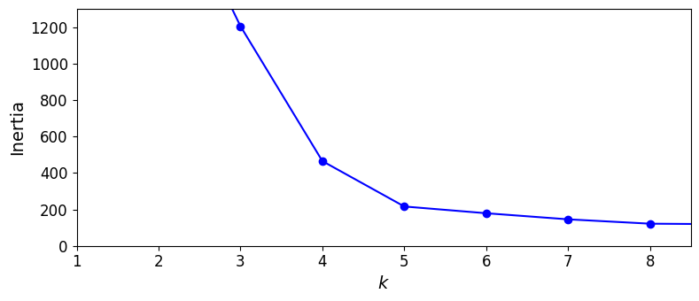
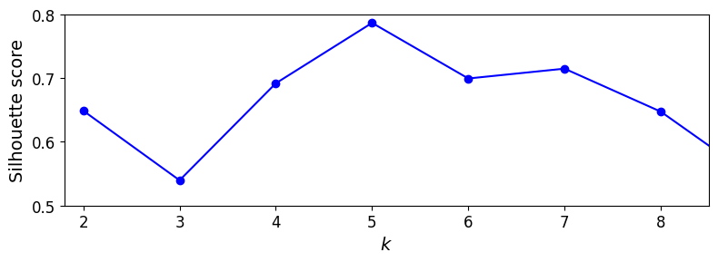
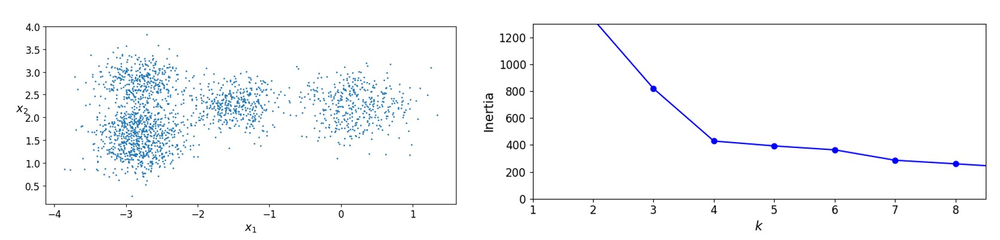
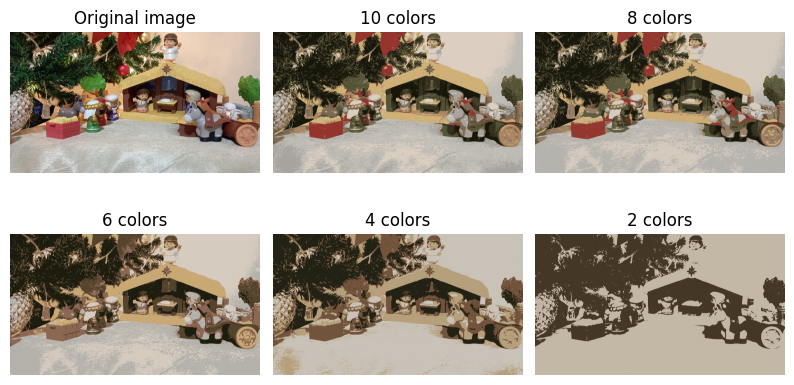
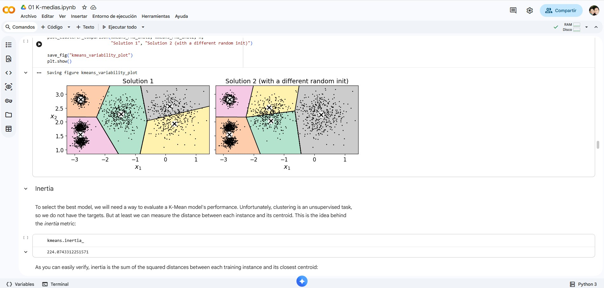
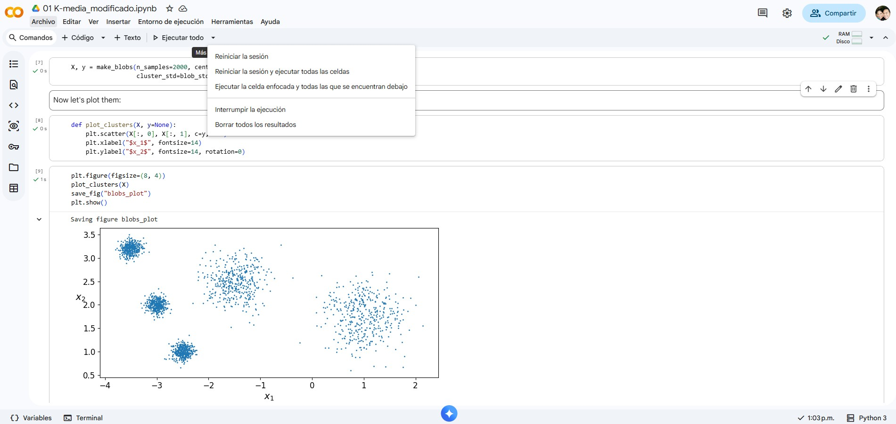

# Ejercicio 1 — Separar los blobs y volver a elegir \(k\)

## Contexto

La notebook `Clustering K-medias/Notebooks/01 K-medias.ipynb` (capítulo de
Géron / Hands-On ML) entrena **k-means** de scikit-learn sobre nubes
gaussianas y termina con segmentación de color de una foto.

La parte central genera **5** blobs, ajusta `KMeans(n_clusters=5, ...)` y
después busca el \(k\) “bueno” con dos herramientas:

| Herramienta | Qué grafica | Lectura en la notebook original |
|---|---|---|
| **Codo** (inercia \(J\) vs \(k\)) | `inertias` para \(k = 1,\ldots,9\) | El codo está en **\(k = 4\)**, no en 5 |
| **Silueta** | `silhouette_score` para \(k = 2,\ldots,9\) | \(k = 4\) se ve muy bien; **\(k = 5\)** también |

Eso no es un bug: tres blobs de la izquierda están **casi pegados**
(`std = 0.1` y centros en \(x = -2.8\)). K-means (y el codo) los trata como
un solo grupo.

En este ejercicio **sí vas a modificar código**, pero un cambio pequeño y
local: **alejar esos blobs**. No toques `Clustering K-medias/project/`.
Trabajas en **Colab**, sobre una **copia** de la notebook.

## Objetivo

Correr la notebook en Colab **tal como está**, anotar el \(k\) que sugieren
codo y silueta, **separar los 5 blobs** en el arreglo `blob_centers` (y, si
hace falta, `blob_std`) y volver a graficar. Debes ver si el codo y la
silueta se mueven hacia **\(k = 5\)**.


## 1. Version original

### Configuracion
   ```python
   blob_centers = np.array(
       [[ 0.2,  2.3],
        [-1.5 ,  2.3],
        [-2.8,  1.8],
        [-2.8,  2.8],
        [-2.8,  1.3]])
   blob_std = np.array([0.4, 0.3, 0.1, 0.1, 0.1])
   ```


### Scatter de los blobs


### Voronoi con \(k = 5\)


### Curva de inercia — Codo


### Curva de silueta


### Valores obtenidos

| \(k\) | Inercia |
|---:|---:|
| 3 | 653.2167190021554|
| 5 | 211.59853725816828|
| 8 | 127.13141880461835|

**\(k\) seleccionado mediante el método del codo:** 
4

**\(k\) con mayor valor de silueta:** 
4

## 2. Version modificada

### Configuracion

```python
blob_centers = np.array(
    [[ 1,  1.8],
     [-1.5 ,  2.5],
     [-3.5,  3.2],
     [-3,  2],
     [-2.5,  1]])
blob_std = np.array([0.4, 0.3, 0.1, 0.1, 0.1])
```

### Scatter de los blobs modificados



### Voronoi con \(k = 5\)



### Curva de inercia — Codo



### Curva de silueta



### Valores obtenidos

| \(k\) | Inercia |
|---:|---:|
| 3 | 1204.7032547003655|
| 5 | 215.99321559182087|
| 8 | 121.65692282446918|

**\(k\) seleccionado mediante el método del codo:** 
5 

**\(k\) con mayor valor de silueta:** 
5

## 4. Análisis
<!-- 
4. Un breve reporte (media página) que responda:
   - En los datos de Géron, ¿por qué el codo “prefiere” \(k = 4\) si
     `make_blobs` usó 5 centros?
   - Con tus blobs separados, ¿el codo y la silueta coinciden en el mismo
     \(k\)? ¿Ese \(k\) es 5?
   - Si el codo sigue en 4, ¿qué te falta mover (distancia entre centros
     vs. `blob_std`)? -->

En el caso de Geron el codo usar 4 porque es donde empieza a existir una disminucion de la inercia. Para mi caso en la version modificada el k para el metodo de codo podria ser 4, pero elegiria 5. Y para el caso del de silueta si el k=5 es el que obtuvo mayor score.


## 5. Reto opcional

- Deja los centros de Géron y **solo** sube los tres `std = 0.1` a
  `0.4`. ¿El codo se mueve igual que al **alejar** los centros?
  R: El codo es bastante similar, solo que para k=4 se mantiene mas estable la inercia.



- En la última sección, sustituye `ladybug.png` por **una imagen tuya**
  y compara 10 / 8 / 6 / 4 / 2 colores. ¿Con cuántos colores reconoces
  todavía el objeto? R: Creo que por la cantidad de contrastes de color de la imagen hasta con 2 colores aun se puede reconocer gran parte de la imagen


## 6. Conclusiones

El algoritmo k-medias es util para agrupar y clasificar. Las graficas de codo y silueta son muy utiles para determinar cuando una k produce el grupo optimo de grupos.


## 7. Evidencias

### Notebook
[Notebook modificada](01_K_media_modificado.ipynb)

### Screenshots



