# Reporte — Sistema RAG de películas

**Stack:** Streamlit + FastAPI + ChromaDB + Google AI (embeddings y Gemini)

## 1. Dominio y tamaño del corpus

- **Dominio:** sinopsis y datos de películas (título, año, origen, director,
  reparto, género y trama).
- **Fuente:** dataset *Wikipedia Movie Plots* (Kaggle, autor *jrobischon*):
  <https://www.kaggle.com/datasets/jrobischon/wikipedia-movie-plots>. El
  contenido proviene de Wikipedia; la licencia es la que indica la página del
  dataset.
- **Formato:** un CSV; cada fila es un documento.
- **Dataset usado en las pruebas:** `movies_test.csv` (300 KB) con **84
  películas** que generaron **248 chunks**.
- **Dataset completo:** `movies_clean.csv` (unas 34 mil películas), preparado
  para una prueba más extensa. No se ingirió por el límite de créditos (cuota)
  de la API de Gemini, ya que cada chunk consume cuota de embeddings. Todos los
  resultados de este reporte corresponden a la muestra.
- **Modelo de embeddings:** `gemini-embedding-001`, el mismo para chunks y
  preguntas.
- **Modelo de generación:** `gemini-3.8-flash`.

## 2. Cómo particioné y por qué

Ventanas de **300 palabras con 50 de solape**, configurables. Cada película se
convierte en un texto con todos sus campos, así el título, el año o el director
viajan en el mismo chunk que la trama y la recuperación puede apoyarse en
cualquiera de ellos. Las tramas son largas: 84 películas produjeron 248 chunks
(unos 3 por película), por lo que el solape evita perder información en el
corte entre chunks. Antes de indexar se eliminan de la trama los marcadores
numéricos de referencia tipo `[1]`, para que no se confundan con las citas
`[n]` del modelo.

## 3. Cómo decido abstenerme

Hay dos capas:

1. **Umbral de similitud (`MIN_SCORE = 0.60`).** Si el mejor chunk recuperado
   tiene similitud coseno menor que el umbral, la API responde
   `abstained: true` con el mensaje "No hay información suficiente en los
   documentos para responder esta pregunta." y **no llama a Gemini**.
2. **Prompt de Gemini.** Si el umbral se supera, el modelo solo puede usar los
   chunks numerados, debe responder en español y con citas, y si el contexto no
   alcanza debe devolver el mensaje de abstención.

Nunca se rellena con conocimiento propio del modelo. El umbral se eligió a
partir de las pruebas:

| # | Pregunta | Tipo | Mejor similitud | Resultado |
|---|---|---|---|---|
| 1 | de que trata Star Wars: The Last Jedi? | En dominio (combina 3 chunks) | 0.7629 | Responde con citas `[1][2][3]` |
| 2 | de que año es alicia en el pais de las maravillas? | En dominio (en español, corpus en inglés) | 0.6557 | Responde: 1903, cita `[1]` |
| 3 | Zack Snyder dirigio alguna pelicula? si fue asi de que genero fue? | En dominio (pregunta en dos partes) | 0.6172 | Responde: *Justice League* y sus géneros, cita `[1]` |
| 4 | quien dirigio titanic? | Fuera de dominio (suena a cine) | 0.5327 | Se abstiene |
| 5 | quien fue presidente de mexico en 2017 | Fuera de dominio | 0.5415 | Se abstiene |

Las preguntas fuera de dominio quedan en 0.54 o menos y las del dominio en 0.61
o más, así que 0.60 queda entre ambos grupos. El margen es estrecho: la
pregunta legítima más baja supera el umbral por solo 0.017 y la imposible más
alta queda 0.059 por debajo. Con el corpus completo, o con preguntas en otro
idioma, conviene recalibrar el umbral.

## 4. Qué hace cada pieza

| Pieza | Responsabilidad |
|---|---|
| **Google AI (embeddings)** | Convierte cada chunk y cada pregunta en un vector (`gemini-embedding-001`). |
| **Google AI (generación)** | Redacta la respuesta anclada en los chunks recuperados, con citas (`gemini-3.8-flash`). |
| **ChromaDB** | Guarda chunks, vectores y metadatos en disco (`chroma/`) y devuelve los `top_k` más similares por distancia coseno. Es persistente: reiniciar la API no borra el índice. |
| **FastAPI** | Orquesta el flujo: chunking, llamadas a Google AI y Chroma, umbral de abstención y errores HTTP. |
| **Streamlit** | Cliente HTTP de la API: carga el CSV, envía preguntas y muestra respuesta, citas y scores. No accede a Chroma ni a Google AI. |

## 5. Pruebas realizadas

Archivo de prueba: `data/movies_test.csv` (300 KB): **84 películas, 248 chunks**.

| Pregunta | Tipo | Mejor similitud | Resultado |
|---|---|---|---|
| De qué trata Star Wars: The Last Jedi | En dominio (combina 3 chunks) | 0.7629 | Responde con citas `[1][2][3]` |
| De qué año es Alicia en el país de las maravillas | En dominio (en español, corpus en inglés) | 0.6557 | Responde: 1903, cita `[1]` |
| Zack Snyder dirigió alguna película y de qué género fue | En dominio (pregunta en dos partes) | 0.6172 | Responde: *Justice League* y sus géneros, cita `[1]` |
| Quién dirigió Titanic | Fuera de dominio (suena a cine) | 0.5327 | Se abstiene |
| Quién fue presidente de México en 2017 | Fuera de dominio | 0.5415 | Se abstiene |

Con este corpus, las preguntas fuera de dominio quedan en 0.54 o menos y las
del dominio en 0.61 o más, así que `MIN_SCORE = 0.60` queda entre ambos grupos.
El margen es estrecho (la pregunta legítima más baja supera el umbral por
0.017). Si el corpus crece o cambia el idioma de las preguntas, conviene
recalibrarlo.

## 6. Evidencias

### 6.1 Puesta en marcha

API (FastAPI con Uvicorn, puerto 8000):

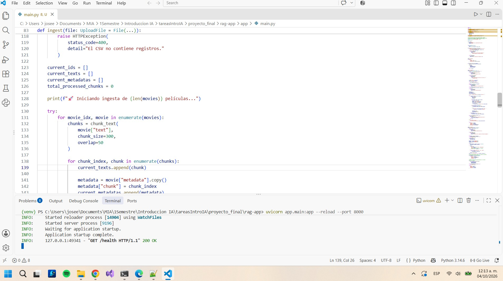

UI (Streamlit, puerto 8501):

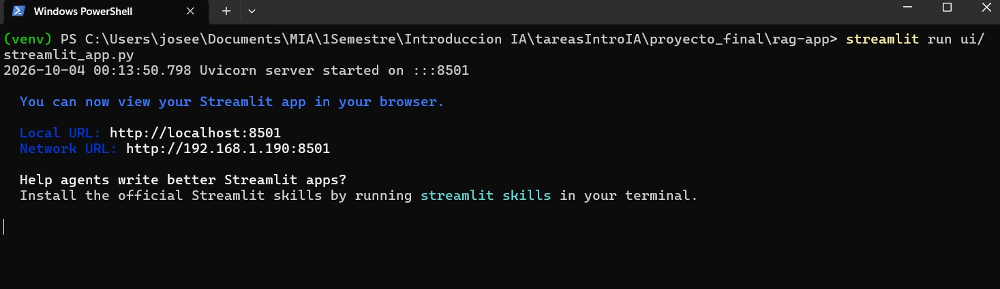

Documentación automática de la API, con `/health`, `/ingest` y `/query`:

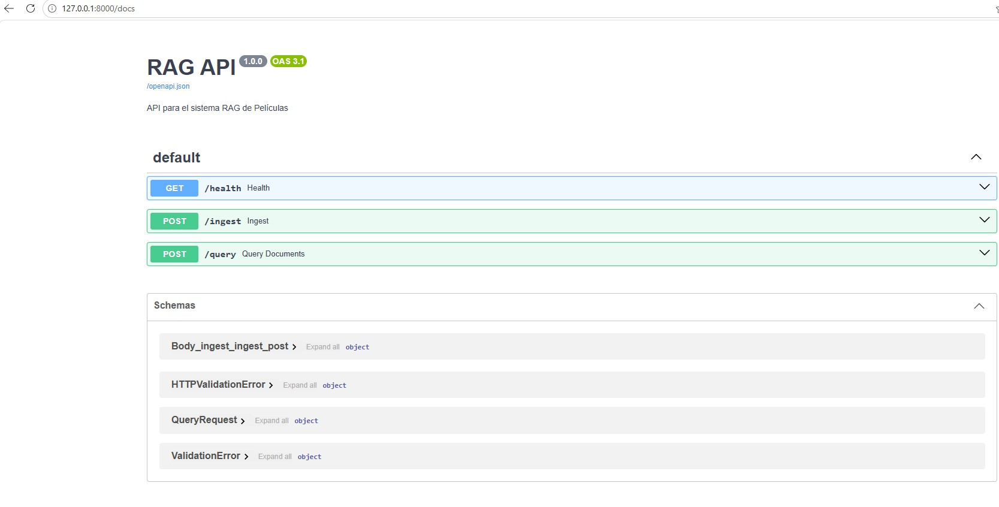

### 6.2 Ingesta del corpus desde Streamlit

Antes y durante la ingesta: el índice está vacío (0 chunks) y la UI lo avisa.

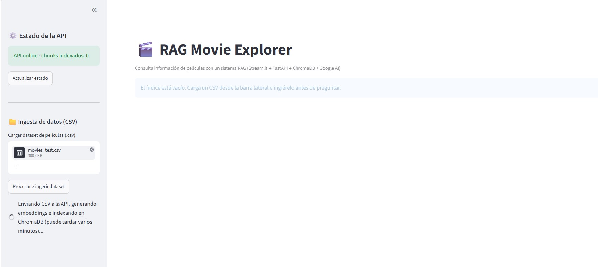

Después de la ingesta: 84 películas y 248 chunks indexados, y el formulario de
preguntas se habilita automáticamente.

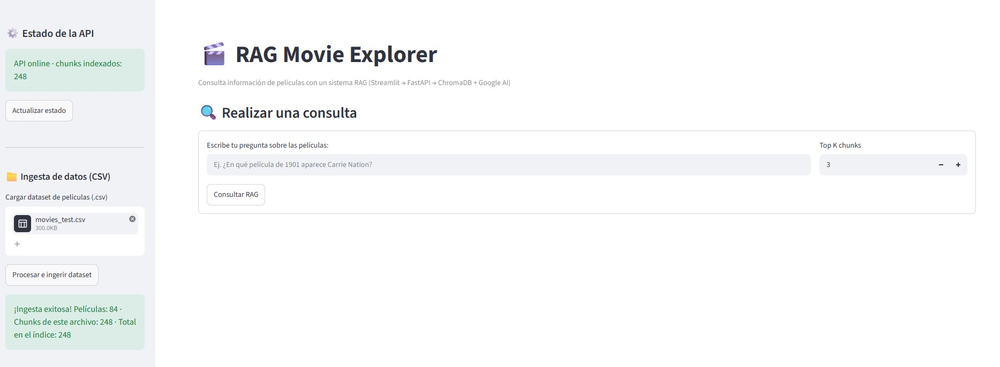

### 6.3 Streamlit: respuesta con citas y scores

Pregunta 1 (*de que trata Star Wars: The Last Jedi?*): la respuesta combina tres
chunks, con citas `[1]`, `[2]` y `[3]`, y la evidencia muestra título, año y
similitud de cada chunk.

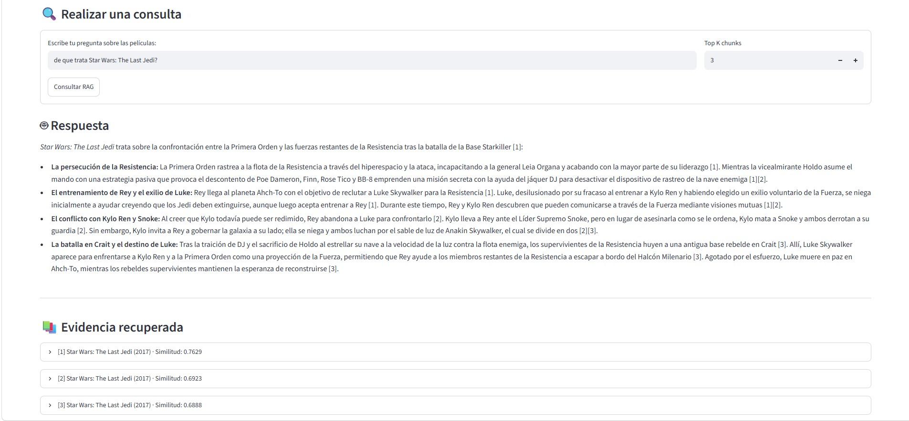

Pregunta 2 (*de que año es alicia en el pais de las maravillas?*): la pregunta
está en español y el corpus en inglés; aun así se recupera la película correcta.

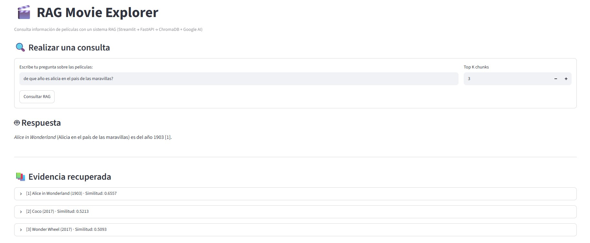

Pregunta 3 (*Zack Snyder dirigio alguna pelicula? si fue asi de que genero
fue?*): responde con *Justice League* y sus géneros, citando `[1]`.

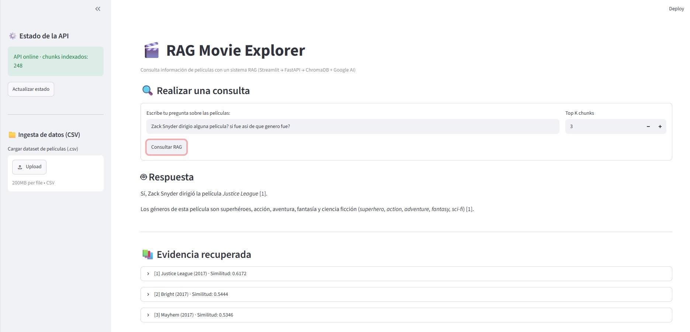

### 6.4 La misma pregunta contra FastAPI (`/docs`)

Petición a `POST /query` con la pregunta 1 y `top_k = 3`:

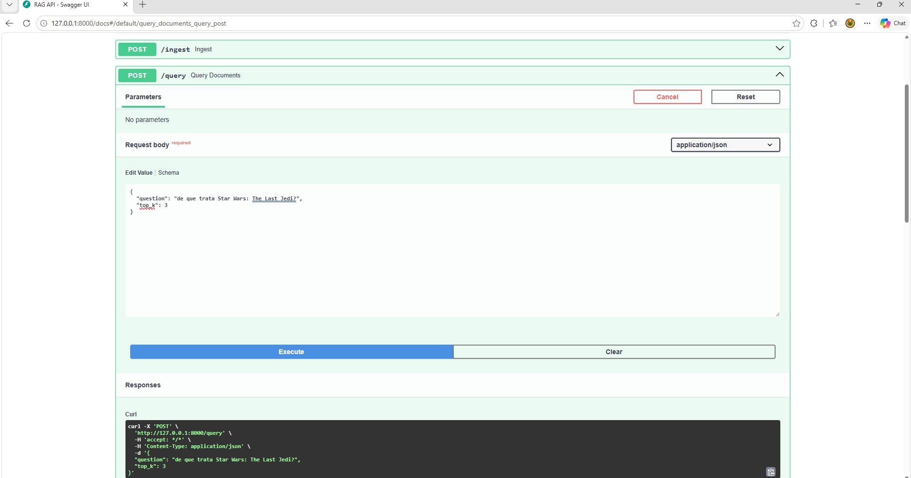

Respuesta JSON (código 200): `answer` con citas `[n]` y `citations` con el
texto, origen, score, título, año, fila y chunk de cada evidencia.

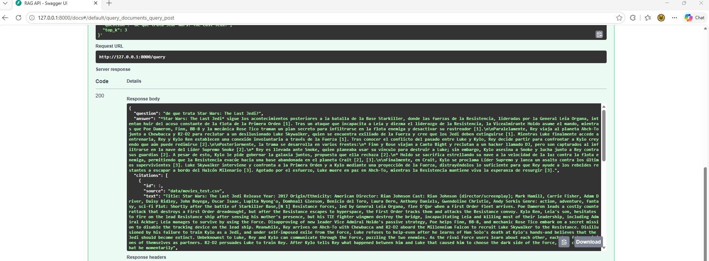

### 6.5 Preguntas fuera de dominio: el sistema se abstiene

Pregunta 4 (*quien dirigio titanic?*) en Streamlit: aviso de abstención,
mensaje de respuesta y evidencia marcada como insuficiente (mejor similitud
0.5327).

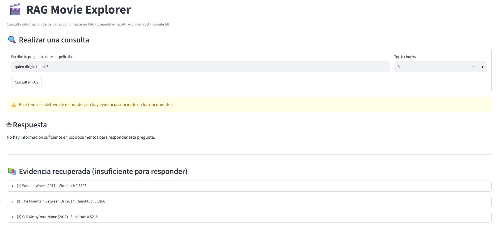

La misma pregunta contra la API: `answer` con el mensaje de abstención y los
chunks recuperados con scores por debajo del umbral.

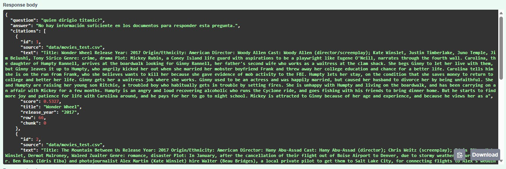

Pregunta 5 (*quien fue presidente de mexico en 2017*) contra la API: se
abstiene con el mejor score en 0.5415.

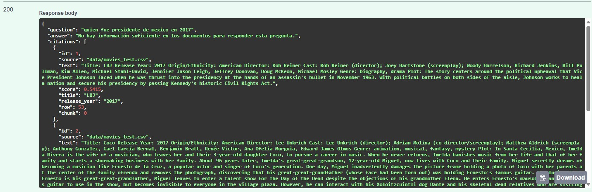

### 6.6 Persistencia del índice

Tras reiniciar la API, la UI sigue reportando 248 chunks indexados y el
formulario de preguntas disponible, sin volver a cargar ni ingerir el CSV
(Chroma persiste el índice en `chroma/`).

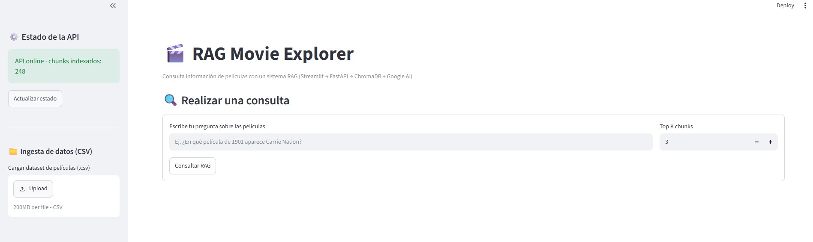

La misma comprobación contra la API: `GET /health` responde 200 con
`"chunks": 248` y `"google_api_key": true`.

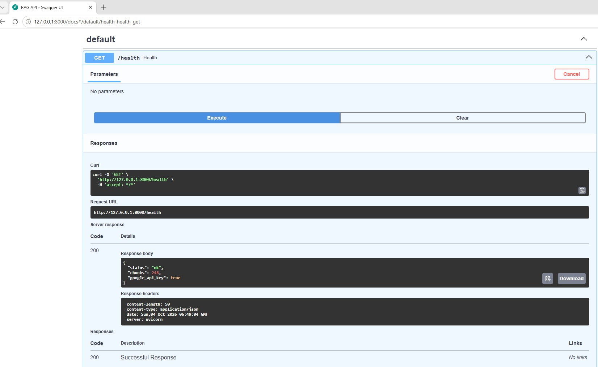

## 7. Fuente del dataset

Dataset **Wikipedia Movie Plots** (Kaggle, autor *jrobischon*):
<https://www.kaggle.com/datasets/jrobischon/wikipedia-movie-plots>. El
contenido proviene de Wikipedia; la licencia es la que indica la página del
dataset.

Se prepararon dos archivos con el mismo formato:

- `movies_test.csv` (300 KB, 84 películas, 248 chunks): muestra usada en todas
  las pruebas y capturas de este proyecto.
- `movies_clean.csv` (unas 34 mil películas): corpus completo, pensado para una
  prueba más extensa. No se ingirió por completo por el límite de créditos
  (cuota) de la API de Gemini: cada chunk consume cuota de embeddings. La
  ingesta soporta el archivo completo, pero tardará y consumirá bastante cuota.

## 8. Archivo Readme
[README.md](./rag-app/README.md)

